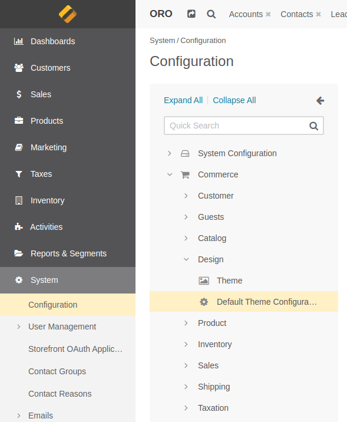
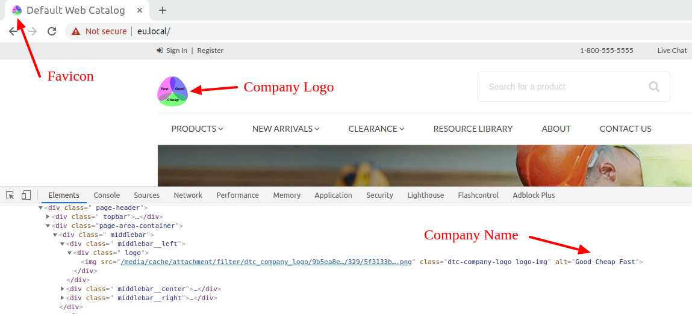
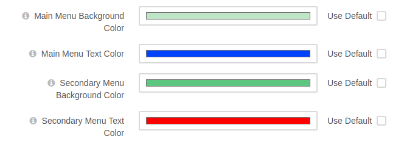
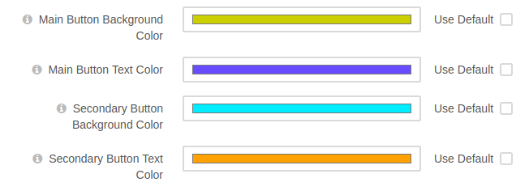
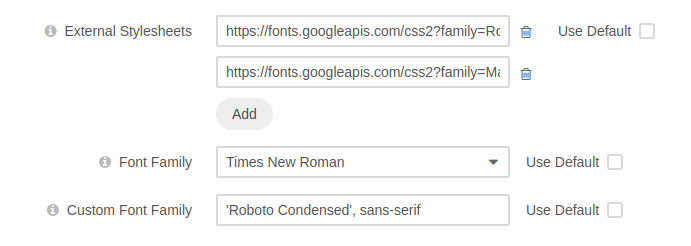

# OroCommerce Default Theme Configuration Bundle

The bundle allows configuring the default OroCommerce theme from the user interface without writing any code. 
It allows setting multiple theme options (logo, colors, font, styling) and customize visual representation of the storefront.

The bundle is compatible both with the Community Edition and Enterprise Edition of OroCommerce.

* [How To Install The Bundle](#how-to-install-the-bundle)
* [Where Is Configuration?](#where-is-configuration)
* [What Options Can Be Configured?](#what-options-can-be-configured)
    * [Logo Configuration](#logo-configuration)
    * [Main Colors](#main-colors)
    * [Secondary Colors](#secondary-colors)
    * [Menu Colors](#menu-colors)
    * [Button Colors](#button-colors)
    * [Additional Styling](#additional-styling)
    * [CSS Styling](#css-styling)
* [How To Thank The Author](#how-to-thank-the-author)


## How To Install The Bundle

Open the OroCommerce application root and run the following command:

```
composer require ys-tools/default-theme-configuration-bundle
```

If application is already installed then cache has to be cleared manually:

```
php bin/console cache:clear --env=prod
```


## Where Is Configuration?

The default theme configuration has to be set in System Configuration. It can be found in the management console menu
_System > Configuration_ inside the _Commerce > Design > Default Theme Configuration_ section.




## What Options Can Be Configured?

There are many visual options split into several groups. Community Edition supports only global configuration,
while Enterprise Edition supports both global and website level configuration.
 
 
### Logo Configuration


**Company Logo** sets company logo in the application header. Logo is automatically resized to
50 pixels in height to fit the header

**Company Name** sets alternative text for the company logo




### Main Colors


**Header And Footer Background Color** sets the background color of both header and footer of the page

**Header And Footer Text Color** sets the color of text (both plain and links) in the header and footer of the page

**Table Header Background Color** sets the background color of standard table headers

**Table Header Text Color** sets the color of the text used in standard table headers


### Secondary Colors


**Icon Background Color** sets the background color of icon and icon based elements

**Icon Content Color** sets the color of icon and icon based elements

**Form Background Color** sets the background color of the forms and similar elements

**Link Color** sets the color of links and interactive elements (radio buttons, checkboxes)


### Menu Colors



**Main Menu Background Color** sets the background color of the main menu

**Main Menu Text Color** sets the text color of the main menu

**Secondary Menu Background Color** sets the background color of the secondary menus and similar elements

**Secondary Menu Text Color** sets the text color of the secondary menus and similar elements


### Button Colors



**Main Button Background Color** sets the background color of main buttons (Submit, Yes, Confirm)

**Main Button Text Color** sets the text color of main buttons

**Secondary Button Background Color**  sets the background color of secondary buttons (Cancel, No, Decline)

**Secondary Button Text Color** sets the text color of secondary buttons


### Additional Styling



**Font Family** sets the font used all over the storefront


### CSS Styling


**Global Styling** adds custom CSS styles to all storefront pages 

**Home Page Styling**, **Product Listing Page Styling**, **Product Details Page Styling**, 
**Quick Order Form Styling**, **Shopping List Styling**, **Checkout Styling**
add custom CSS styles to appropriate pages, these styles put after the global styling and
may override it


## How To Thank The Author

If this bundle helped you and you are feeling generous today, then you can thank the author
and support this initiative using the following button.

[](https://www.paypal.com/cgi-bin/webscr?cmd=_s-xclick&hosted_button_id=J9945JLRB47N2&source=url)
